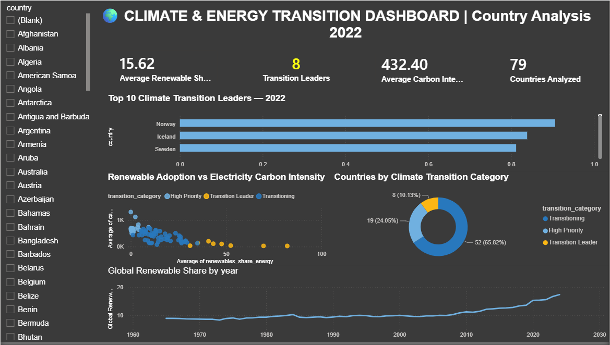

# Climate & Energy Transition Dashboard

## Overview

An interactive data analytics project that analyzes global climate
and energy trends using Python, PostgreSQL, and Power BI.

## Tools & Technologies

- Python
- Pandas
- NumPy
- PostgreSQL
- SQL
- Power BI

## Project Workflow

Python
→ Data Cleaning & EDA
→ PostgreSQL
→ SQL Analysis
→ Power BI
→ Interactive Dashboard

## Key Analysis

- Renewable energy adoption
- Electricity carbon intensity
- Energy efficiency
- Country-wise comparison
- Climate transition score
- Transition leader identification
- Renewable energy trends

## Dashboard

The Power BI dashboard provides:

- KPI cards
- Top transition leaders
- Renewable adoption vs carbon intensity
- Climate transition categories
- Renewable energy trend
- Country filtering

## Power BI Dashboard Screenshot

## Key Skills Demonstrated

- Data Cleaning
- Exploratory Data Analysis
- SQL
- Data Transformation
- Data Visualization
- Power BI Dashboard Development
